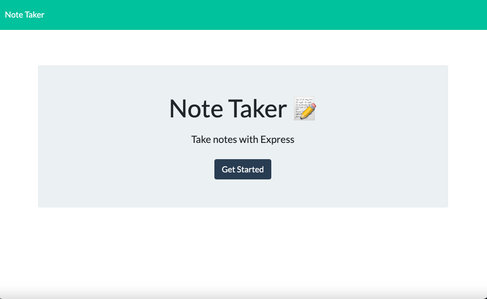

# Note-Taker

## Table of Contents

- [Description](#description)

- [Deployed Link](#deployed-link)

- [Installation](#installation)

- [Repository](#Repository)

- [CodeSnippets](#CodeSnippets)

- [License](#license)

- [TechnonlogyUse](#Technonlogy-Use)

- [Question](#Question)

## Description

- This is a simple Note Taker application that allows users to add, view saved notes and
  also delete the notes if the user don't need that note anymore.
  This application uses an express backend and save and retrieve note data from a JSON file

## Deployed Link

- https://sleepy-inlet-68851.herokuapp.com

## Installation

- npm init
- npm install inquirer

## Repository

- Run the following command at the terminal for your answer.

- node server.js

## CodeSnippets

- This Code a function for handling the requests and responses for delete note.

      app.delete("/api/notes/:id", (req, res) => {

         let noteList = JSON.parse(fs.readFileSync("./db/db.json", "utf8"));

         let noteId = (req.params.id).toString();

          noteList = noteList.filter(selected => {

       return selected.id != noteId;
      })
      fs.writeFileSync("./db/db.json", JSON.stringify(noteList));

      res.json(noteList);

      });

## Technonlogy Use

- Express.js
- HTML And CSS
- Node.js
- Javascript

## License

## Question

- [Email](abuye20@yahoo.com)

- [LinkedIn](https://www.linkedin.com/in/abuye-mamuye-5a49921b0/)

- [GitHub](https://github.com/AbuyeM1)

## Acknowledgments

- Jerome Chenette (Instructor)
- Manuel Nunes (TA)
- Mahisha Manikandan (TA)
- UC Berkeley Coding Bootcamp
